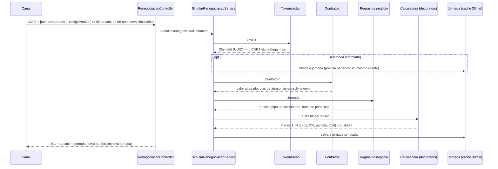

# ProjetoItau — Renegociação de Contratos PJ

Projeto para desafio técnico do Itaú: simulação de renegociação de contratos PJ em atraso, com foco em
**Arquitetura Limpa**, **SOLID** e em mecanismos para **desligar gradualmente a calculadora do mainframe**.

**Stack:** Java 21 · Spring Boot 3.4 · Maven · Caffeine · JUnit 5 · ArchUnit

## Como executar

```bash
./mvnw verify            # build + testes (unitários, arquitetura e integração)
./mvnw spring-boot:run   # sobe em http://localhost:8080 (Swagger em /swagger-ui.html)
```

O projeto não depende de nada externo para rodar: os serviços de terceiros (tokenização, contratos,
regras de negócio e as duas calculadoras) são emulados por **simuladores** embarcados, que a aplicação
chama via HTTP real. Para apontar para os serviços de verdade, basta trocar as URLs em `renegociacao.integracoes`
e desligar `simuladores.habilitados`.

### Exemplo

```bash
curl -i -X POST http://localhost:8080/v1/renegociacoes/simulacoes \
  -H "Content-Type: application/json" \
  -d '{"cnpj":"11.222.333/0001-81","contratos":[{"numeroContrato":"123456","codigoProduto":"PJ01"}]}'

# nova simulação na mesma jornada (o idJornada se mantém; a seleção de contratos pode mudar)
curl -X POST http://localhost:8080/v1/renegociacoes/jornadas/{idJornada}/simulacoes \
  -H "Content-Type: application/json" \
  -d '{"cnpj":"11.222.333/0001-81","contratos":[{"numeroContrato":"123456","codigoProduto":"PJ01"},{"numeroContrato":"654321","codigoProduto":"PJ02"}]}'

# próximo passo da jornada consome o que foi salvo
curl http://localhost:8080/v1/renegociacoes/jornadas/{idJornada}

# liga a calculadora modernizada (desliga a do mainframe) em tempo de execução
curl -X PUT http://localhost:8080/v1/admin/feature-flags/calculadora-modernizada \
  -H "Content-Type: application/json" -d '{"habilitada":true}'
```

### Postman

A collection `postman/renegociacao-pj.postman_collection.json` traz o fluxo completo, com testes em cada request.
As pastas podem ser executadas sozinhas ou em sequência (Run collection):

1. **Calculadora mainframe** e 2. **Calculadora modernizada**: cada pasta seleciona a sua calculadora pela flag,
   simula, repete a simulação (vinda do cache), simula de novo na mesma jornada e consulta a jornada.
   A pasta 2 também confere a paridade dos planos com a pasta 1.
3. **Troca de calculadora**: a mesma simulação alternando mainframe → modernizada → mainframe, mostrando que
   uma calculadora nunca reaproveita o cache da outra.
4. **Cenários de erro**: 400, 404 e 422.

## Fluxo



## Arquitetura

```
domain/          Entidades, objetos de valor e invariantes. Java puro.
application/     Casos de uso, portas (in/out) e decorators de política (cache, roteamento).
adapter/in/      Controllers REST, DTOs e tratamento de erros.
adapter/out/     Implementações das portas: HTTP, Caffeine, feature flag.
infrastructure/  Composição (beans) e propriedades. Único lugar que conhece as implementações.
simulador/       Emulação dos serviços externos. Isolado: não compartilha nenhuma classe com a aplicação.
```

As regras de dependência são **verificadas por teste** (`ArquiteturaTest`, ArchUnit):
domínio e aplicação não podem depender de Spring, Jackson, Caffeine ou Jakarta, e as dependências
apontam sempre para dentro.

### A calculadora: como desligar o mainframe

A calculadora é montada por composição de decorators sobre uma única interface, `CalculadoraPort`:

```
CalculadoraComCache (por cliente + motor ativo)        ← 1º: evita recalcular a mesma simulação do cliente
 └─ CalculadoraRoteadaPorFeatureFlag                   ← 2º: Strangler Fig, flag "calculadora-modernizada"
     ├─ CalculadoraModernizadaHttpAdapter
     └─ CalculadoraMainframeHttpAdapter + SimulacaoMainframeMapper (Anti-Corruption Layer)
```

- **Cache por cliente:** a chave inclui o cliente, os contratos (número e produto) e a política.
  Ela é canônica, ou seja, não depende da ordem dos contratos.
  A chave também inclui o motor ativo na flag, então trocar de calculadora não reaproveita o cache da outra
  (e voltar para a anterior reaproveita o cache dela).
- **Feature flag:** a decisão é tomada a cada chamada, então dá para trocar em produção e voltar atrás
  na hora, sem deploy. O provedor (`FeatureFlagPort`) pode virar AWS AppConfig, LaunchDarkly ou Unleash.
- **ACL do mainframe:** o layout do copybook (nomes de campos COBOL, código de retorno,
  códigos `P`/`S`) fica confinado no pacote `adapter.out.calculadora.mainframe`. Quando o mainframe for
  desligado, esse pacote é apagado e uma linha da configuração muda.
- **Paridade:** o teste de integração compara os planos do mainframe e da modernizada para a mesma entrada.

### SOLID na prática

| Princípio | Onde |
|---|---|
| **S** | Cada decorator tem uma única responsabilidade (cachear, rotear, traduzir). |
| **O** | Novo motor de cálculo ou novo armazenamento = nova implementação de porta, sem alterar o núcleo. |
| **L** | Qualquer `CalculadoraPort` (adapter ou decorator) é intercambiável. |
| **I** | Portas pequenas e específicas (`TokenizacaoClientePort`, `RegrasNegocioPort`, ...). |
| **D** | Casos de uso dependem só de interfaces; a composição fica em `infrastructure.config`. |

### Trocando o cache por banco de dados

`CachePort<K, V>` é genérico e reutilizado para simulações e jornadas. A jornada é
persistida via `JornadaRepositoryPort`. Para usar banco, basta criar, por exemplo,
`JornadaJpaRepositoryAdapter implements JornadaRepositoryPort` e trocar o bean em `AdaptadoresConfig`.
Domínio, casos de uso e testes unitários não mudam.

## LGPD

- O CNPJ é convertido em `ClienteId` (UUID) logo na entrada, pelo serviço de tokenização, e não aparece em
  jornada, cache, chamadas internas, respostas ou logs. O `toString` de `Cnpj` e do request é mascarado.
- Aceita também o **CNPJ alfanumérico** (IN RFB 2.229/2024, vigente desde julho de 2026).

## Decisões e premissas

- **Jornada:** o `id_jornada` (UUID) é gerado na primeira simulação e se mantém nas seguintes. O canal o reenvia
  em `POST /jornadas/{idJornada}/simulacoes`, e a jornada é recalculada (contratos, política e planos),
  substituindo a simulação anterior. Uma jornada só pode ser simulada de novo pelo mesmo cliente tokenizado;
  para outro cliente ela é tratada como inexistente (404), sem revelar que existe. A jornada é imutável:
  cada etapa devolve uma nova instância, o que a torna segura para cache.
- **Política × feature flag:** a política de negócio decide o *tipo de cálculo* (PRICE/SAC) e o máximo de
  parcelas (até 12). A feature flag decide o *motor* (mainframe ou modernizada).
- **Custódia:** nos simuladores, o mainframe retorna `F5` e a modernizada retorna `SF`.
- **Caffeine:** `buscarOuCarregar` não usa `cache.get(k, loader)` de propósito. O loader rodaria dentro de um
  lock durante a chamada HTTP, o que com virtual threads (Java 21) prende a carrier thread.
- **Erros:** regra de negócio → 422, recurso inexistente → 404, validação → 400,
  serviço externo → 502 (`ProblemDetail`, RFC 9457).

## Próximos passos sugeridos

- Resiliência nas integrações (Resilience4j: circuit breaker, retry, e fallback da modernizada para o mainframe).
- Shadow traffic: chamar as duas calculadoras e comparar os resultados antes de virar a flag.
- Cache distribuído (Redis) quando houver mais de uma instância; a `ChaveSimulacao` já é uma string canônica.
- Observabilidade: métricas de hit ratio dos caches e de uso por motor de cálculo (Micrometer).